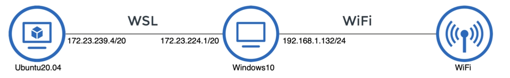
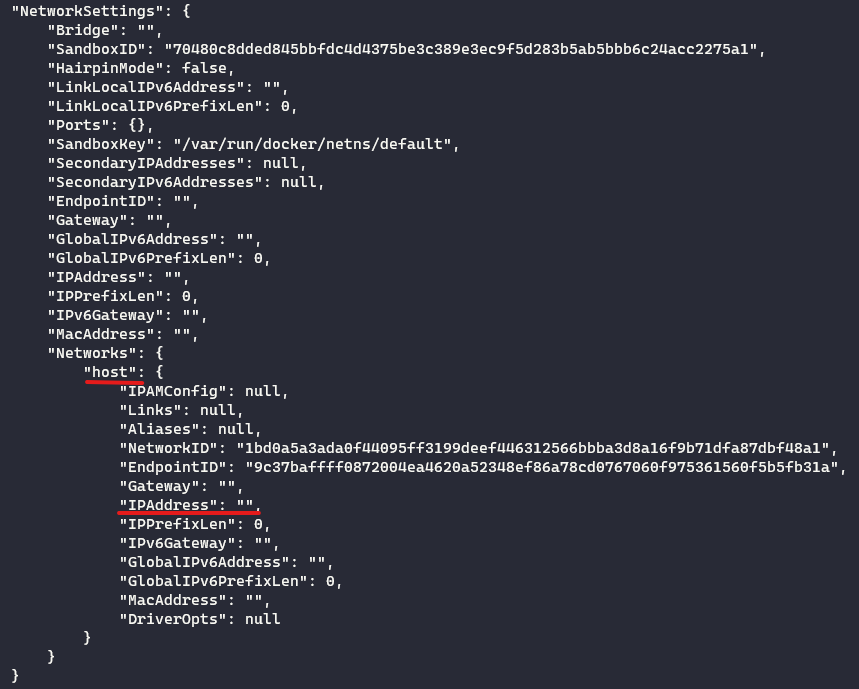

# Home Assistant
## Start / Stop
To start the application use 
```bash
docker-compose up -d
```
```bash
docker-compose down
```

## Log
### 06-01-2022
- SSH into Raspberry Pi
- Set pi@raspberrypi as known host to desktop machine (easy ssh access)
- Installed docker
- Installed docker-compose  
- Docker image: home-assistant
- Accessed Home Assistant via http://<host>:8123
- Coupled initial Smart Tool (Sonos boxes) to home assistant
- Created GitHub repo git@github.com:Paul-Boersma/home-assistant.git

#### 13-01-2022
Studied how Google Nest Thermostat works and how it should be coupled to the Nefit ProLine HRC 24/CW3;

1. Nefit ProLine HRC 24/CW3 (EMS Protocol)
2. Converter to OT Protocol
3. HeatLink --> Need open end power cable + power box
4. Thermostat

Install several integration on home-assistant
- Mosquitto (required the installation of a mosquitto server on Pi and Hass on Desktop)
- Spotify
- Xbox
- Sonos

### 20-01-2022
Wanted to access Home-Assistant service from outside network.
- Requested static IP address
- Required domain from DuckDNS

Since I was now using Port Forwarding I wanted to my sure my connection was save & secure.

Installed additional services on Raspberry Pi to get familiar with the use of these services
- Wireguard (PiVPN)
- Open Media Vault
- Plex

#### 27-01-2022
Was lacking an overview (except for this log) of which services I had running on my Pi.
Created an overview in a Miro Board https://miro.com/app/board/o9J_ksBEwyg=/

The lacking overview let me to study Linux services, so I would be more aware of which ones I had running.
- Linux services (systemd, systemctl and services in general)
- Windows terminal (configuration)

### 29-01-2022
Looked into additonal services by my favourite Raspberry Pi network engineer NetworkChuck
- Load Balancing
- K3s

### 05-02-2022
In search of a better overview I decided my services should be easily accessible through my terminal. To do so I was advised to use docker-compose, which let me to consider the way I wanted to set up this project.

1. Considered what the Project structure should look like
2. Moved project to WSL2 Ubuntu to allow programming & running locally.
3. Tried to fix networking in order to access home assistant from Desktop webbrowser
    - Allow Port Forwarding from Desktop
    - Open up firewall on desktop to allow traffic from local machines to WSL2



Port forwarding from the Windows Desktop for Docker to the container will result in the container getting it's own IP address, preventing home-assistant to find smart devices on the local network.

```bash
docker run -d -p 8123:8123 \
  --name homeassistant \
  --privileged \
  --restart=unless-stopped \
  -e TZ=Europe/Amsterdam \
  -v ${HOME}/Home-Assistant/home-assistant-config:/config \
  ghcr.io/home-assistant/home-assistant:stable
```

To find smart devices on the local network we attach the container to our host network (Ubuntu WSL2)using the option _--network=host_. 

```bash
docker run -d \
  --name homeassistant \
  --privileged \
  --restart=unless-stopped \
  -e Europe/Amsterdam \
  -v ${HOME}/Home-Assistant/home-assistant-config:/config \
  --network=host \
  ghcr.io/home-assistant/home-assistant:stable
```

Which should set the IP address of the docker container to the IP address of it's host (Ubuntu). Now we encounter a problem where the Ubuntu host is on a seperate network from our Windows machine, which can be resolved through port forwarding and opening up the firewall port.

```powershell
# Remote Desktop
netsh interface portproxy add v4tov4 listenport=3390 listenaddress=0.0.0.0 connectport=3390 connectaddress=172.19.150.222

# Home Assistant Docker Container
netsh interface portproxy add v4tov4 listenport=8123 listenaddress=0.0.0.0 connectport=8123 connectaddress=172.19.150.222
```

While this strategy worked for the Remote Desktop (Remote Desktop Connection lets us use the GUI of WSL2 Ubuntu), it did not work for our docker container.

*Troubleshooting:*
- "The host networking driver only works on Linux hosts, and is not supported on Docker Desktop for Mac, Docker Desktop for Windows, or Docker EE for Windows Server." https://docs.docker.com/network/host/
- GitHub issue: https://github.com/docker/roadmap/issues/238
- Verifying the issue (should have done this way earlier in the process...)
```bash
docker inspect home-assistant
```


### 06-02-2022
Secure copy from Ubuntu to Raspberry Pi
Figure out if system is working
  - Can I connect through localhost:8123
  - Can I edit the configuration file and does this result in changes on my localhost:8123
  - Can I use secrets within my config file?
  
  
Implement the use of other services using docker-compose.
  - Open Media Vault
  - Plex Media Server


